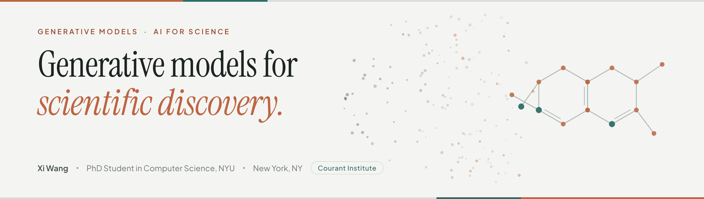
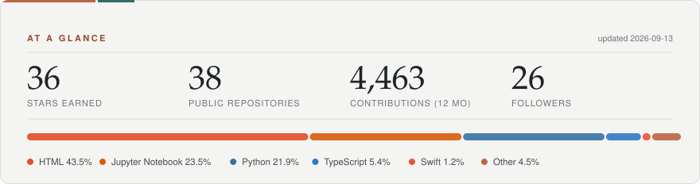
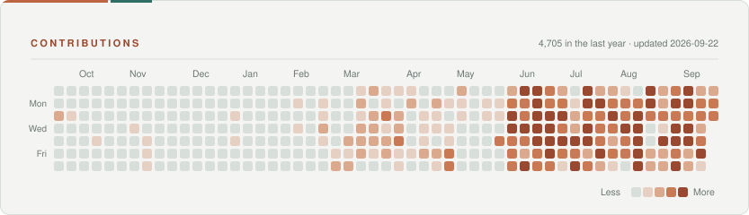

<picture>
  <source media="(prefers-color-scheme: dark)" srcset="assets/banner-dark.png">
  <source media="(prefers-color-scheme: light)" srcset="assets/banner-light.png">
  
</picture>

  
  &nbsp;
  &nbsp;
  &nbsp;
  &nbsp;

---

### About

I am a PhD student in Computer Science at **New York University**, advised by
[Shengjie Wang](https://sheng-jie-wang.github.io/) at the Courant Institute.
Before NYU I read Computer Science and Bioinformatics at Shanghai Jiao Tong University, and
worked on research at DP Technology, Microsoft Research Asia and the University of Michigan.

My long-term goal is to build AI systems that accelerate the discovery of new therapies and,
ultimately, help cure disease and extend human lifespan.

### What I work on

| Direction | What I am after |
|:--|:--|
| **LLM post-training** | Reward-matching objectives and replay strategies for GFlowNets and RL fine-tuning — making generative policies cover modes instead of collapsing onto them. |
| **Diffusion for drug discovery** | Latent and classifier-guided diffusion over 3D molecules: smoother latent spaces, valid geometry, controllable stereochemistry. |
| **Foundation models for RNA, proteins & antibodies** | Large-scale pretraining that captures evolutionary and structural signal, and benchmarks that test whether representations really encode geometry and chirality. |

### Selected publications

| Year | Venue | Paper |
|:--|:--|:--|
| 2026 | `arXiv` | [Smoothing Dark Areas in Molecular Latent Diffusion](https://arxiv.org/abs/2606.13955) |
| 2026 | `ICML` | [Rooted Absorbed Prefix Trajectory Balance with Submodular Replay for GFlowNet Training](https://arxiv.org/abs/2603.00454) |
| 2026 | `ICLR` | [3DCS: Datasets and Benchmark for Evaluating Conformational Sensitivity in Molecular Representations](https://openreview.net/forum?id=JAb0y8lkqL) |
| 2026 | `JCIM` | [RxnBench: A Multimodal Benchmark for Evaluating LLMs on Chemical Reaction Understanding](https://doi.org/10.1021/acs.jcim.6c00286) |
| 2025 | `ICLR DeLTA` | [AtropDiff: Data-Scarce Atropisomer Generation via Classifier-Guided Diffusion](https://openreview.net/forum?id=lwgEUaRxBn) — 🏆 Outstanding Paper |
| 2025 | `J. Cheminformatics` | [CLC-DB: An Open-Source Online Database of Chiral Ligands and Catalysts](https://link.springer.com/article/10.1186/s13321-025-00991-9) |
| 2023 | `bioRxiv` | [Uni-RNA: Universal Pre-Trained Models Revolutionize RNA Research](https://www.biorxiv.org/content/10.1101/2023.07.11.548588v1) |

Full list on my [homepage](https://comdec.github.io/publications/) and
[Google Scholar](https://scholar.google.com/citations?user=IkSb2tIAAAAJ&hl=en).

### Selected repositories

| Repository | What it is |
|:--|:--|
| [**unirna_tf**](https://github.com/ComDec/unirna_tf) | Uni-RNA — the large-scale pre-trained model for RNA science. |
| [**ChemGFN**](https://github.com/ComDec/ChemGFN) | Reward-distribution-matching RL: Rooted Absorbed Prefix Trajectory Balance (ICML 2026). |
| [**Lego_for_Biological_AI**](https://github.com/ComDec/Lego_for_Biological_AI) | Reusable building blocks for AI + Science projects. |
| [**ScienceEvals**](https://github.com/ComDec/ScienceEvals) | An evals harness for LLMs in scientific research. |
| [**unirna-tools**](https://github.com/ComDec/unirna-tools) | A universal toolkit for RNA structure and function. |
| [**ComDec.github.io**](https://github.com/ComDec/ComDec.github.io) | My academic homepage — [comdec.github.io](https://comdec.github.io). |

### Currently

- 🧬 &nbsp;PhD Research Intern at [**ByteDance Seed**](https://seed.bytedance.com/en/)
- 🎓 &nbsp;PhD in Computer Science, NYU Courant — expected 2030
- 📍 &nbsp;New York, NY

---

<picture>
  <source media="(prefers-color-scheme: dark)" srcset="assets/stats-dark.svg">
  <source media="(prefers-color-scheme: light)" srcset="assets/stats-light.svg">
  
</picture>

<picture>
  <source media="(prefers-color-scheme: dark)" srcset="assets/contributions-dark.svg">
  <source media="(prefers-color-scheme: light)" srcset="assets/contributions-light.svg">
  
</picture>

Cards are generated by
[`scripts/generate-stats.mjs`](scripts/generate-stats.mjs) and refreshed daily by
[a workflow](.github/workflows/stats.yml) — no third-party card service involved.
